# Интернет-магазин "Oson"

**Oson** — это удобный и функциональный интернет-магазин, предоставляющий возможности для пользователей, такие как регистрация, просмотр категорий и товаров, поиск, добавление в избранное и корзину, оставление отзывов, а также добавление собственных товаров.

---

## Возможности
1. **Регистрация и вход в аккаунт**
   Позволяет пользователям создавать аккаунт и входить для использования всех функций.
   _Изображение регистрации:_
   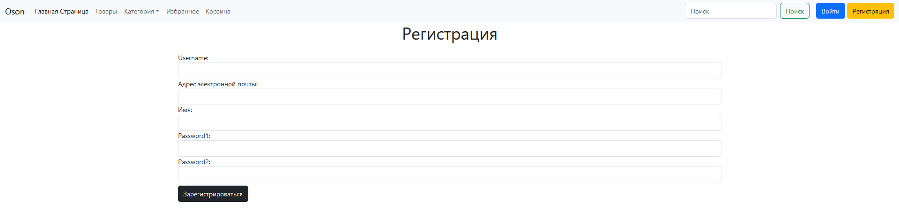
   _Изображение входа:_
   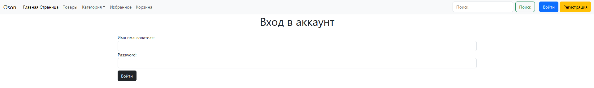

2. **Вывод категорий и товаров**
   Легкий доступ к категориям и товарам для удобного поиска.
   _Изображение категории книг:_
   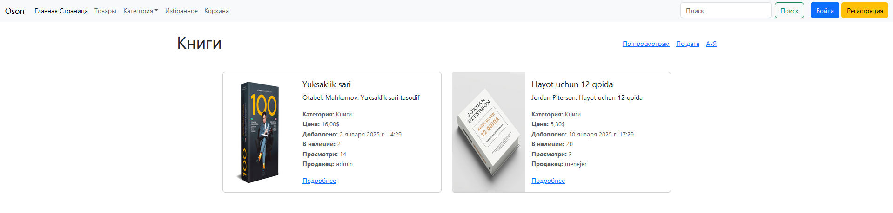
   _Изображение категории телефонов:_
   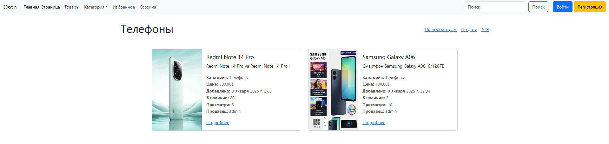

3. **Поиск товаров по названию**
   Быстрый поиск нужного товара с помощью ввода ключевых слов.
   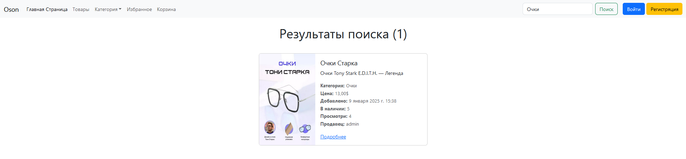

4. **Оставлять отзывы к товарам**
   Зарегистрированные пользователи могут оставлять отзывы для товаров и делиться своим мнением.
   _Изображение отзыва без аккаунта:_
   
   _Изображение отзыва с аккаунтом:_
   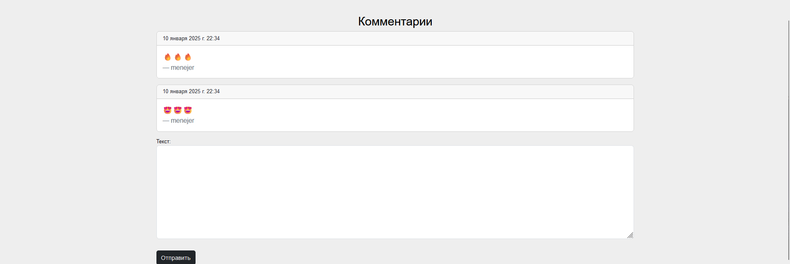

5. **Добавление товара на избранные**
   Зарегистрированным пользователям позволяет сохранять понравившиеся товары в список избранных.
   _Изображение добавления в избранные:_
   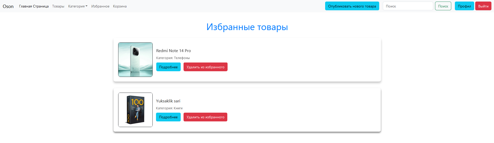
   _Изображение избранных без аккаунта:_
   

6. **Добавление товара на корзину**
   Зарегистрированным пользователям удобно добавлять товары в корзину для совершения покупок.
   _Изображение добавления в корзину:_
   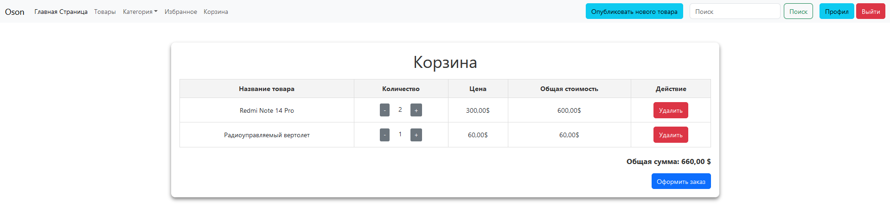
   _Изображение корзины без аккаунта:_
   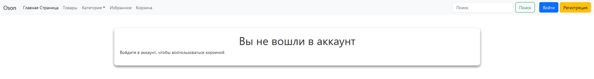

7. **Добавление собственного товара**
   Зарегистрированные пользователи могут добавлять свои товары в магазин.
   _Изображение добавления товара:_
   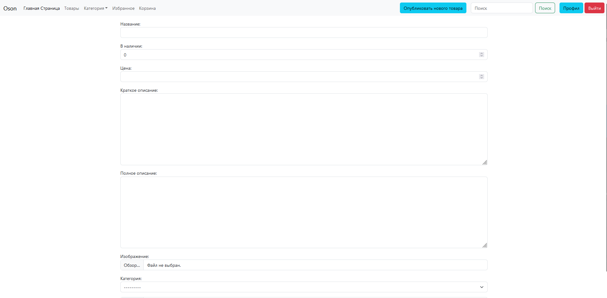
   
---

## Установка и настройка

### 1. Создание виртуального окружения и активация
1.Сначала создайте виртуальное окружение с помощью команды:
```
python -m venv venv
```
2.Активируйте виртуальное окружение:
>Для Windows: В терминале выполните:
```
venv\Scripts\activate
```
>Для Linux/MacOS: В терминале выполните:
```
source venv/bin/activate
```

### 2. Установка всех необходимых пакетов
Установите все пакеты, указанные в requirements.txt, с помощью команды:
```
pip install -r requirements.txt
```
Или по отдельности:
```
pip install django
pip install pillow
```

### 3. Перейдите в директорию проекта
Перейдите в папку вашего проекта с помощью команды:
```
cd oson
```

### 4. Сделайте миграцию базы данных
Для настройки базы данных выполните миграции:
```
python manage.py makemigrations
python manage.py migrate
```

### 5. Запуск сервера
Теперь можно запустить сервер:
```
python manage.py runserver
```

### 6. Откройте браузер
Перейдите по следующему адресу:
```
http://127.0.0.1:8000/
```

### Отчет
    1.Обзор функциональности
    Проект предоставляет пользователям возможность:
        Удобно регистрироваться и авторизовываться.
        Искать и просматривать товары.
        Добавлять собственные товары и управлять ими.
        Добавлять товары в корзину и избранное.

    2.Скриншоты интерфейса
   
   
   
   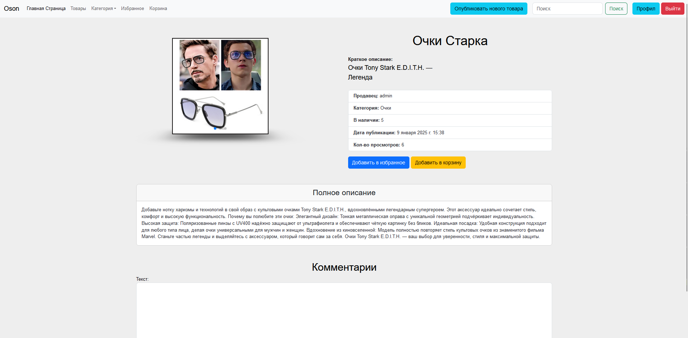
   
   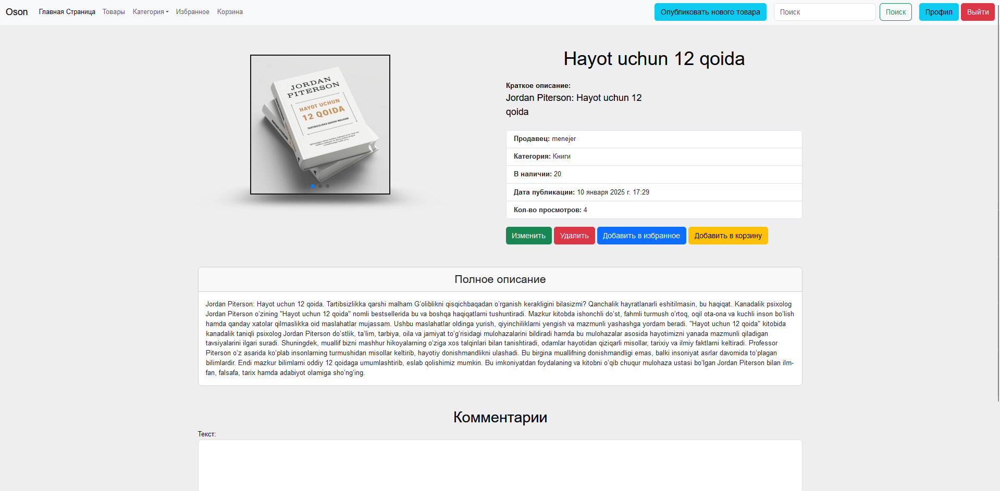
   
   

    Инструкция по запуску
    Подробно расписана в разделе Установка и настройка.


### Контакты
Если у вас возникли вопросы, пожалуйста, свяжитесь с разработчиком проекта.
**Основные изменения:**
```
1. Исправлены ошибки в командной строке, например, уточнена команда
для установки зависимостей из файла requirements.txt с помощью pip install.
2. Добавлены разделы с примерами скриншотов (необходимо вставить или изменить изображения).
3. Пояснено, как использовать файл requirements.txt для удобной
установки всех необходимых пакетов.
```
Instagram аккаунт разработчика: https://www.instagram.com/saidkhon.design